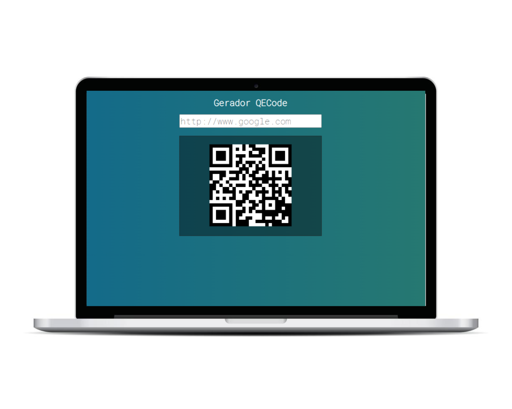

# Gerador de QRcode

## Descrição

Este repositório contém um gerador de QRcode simples, feito com VueJS. O objetivo do projeto é permitir que o usuário insira qualquer texto (como nomes, endereços de sites, mensagens, etc.) em no input e gere um código QR correspondente.

## Tecnologias Utilizadas

- JavaScript
- HTML
- CSS
- Vue

## Como Executar

1. Clone o repositório para o seu computador.
2. Navegue até a pasta raiz do projeto.
3. Inicie o servidor de desenvolvimento.

## Funcionalidades

- Insira qualquer texto no campo de entrada.
- O código QR será exibido na tela.

## Contribuindo

Se você deseja contribuir com este projeto, por favor, faça um fork do repositório e envie um pull request com suas alterações.
